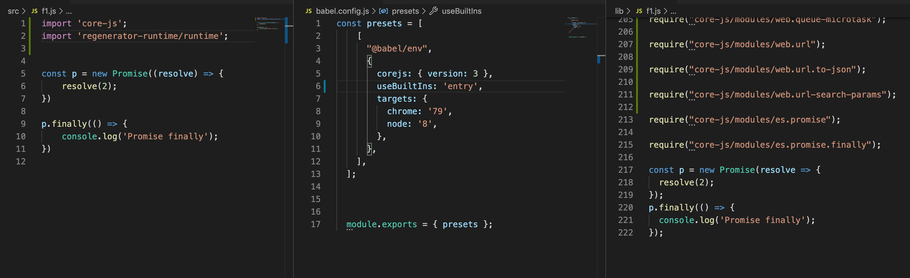
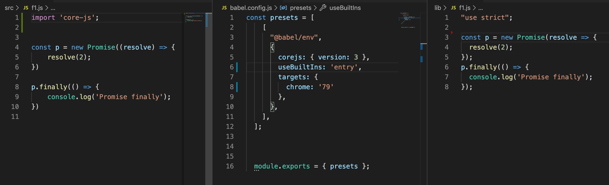
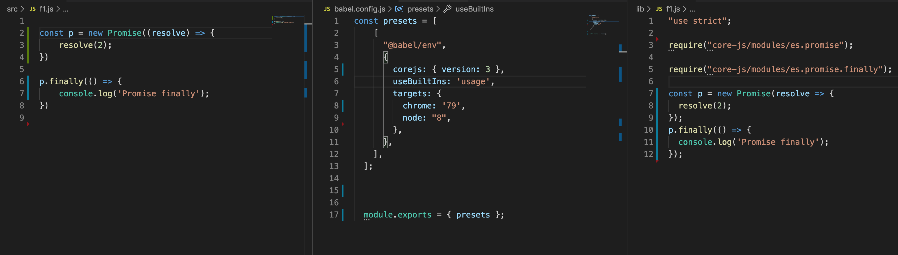
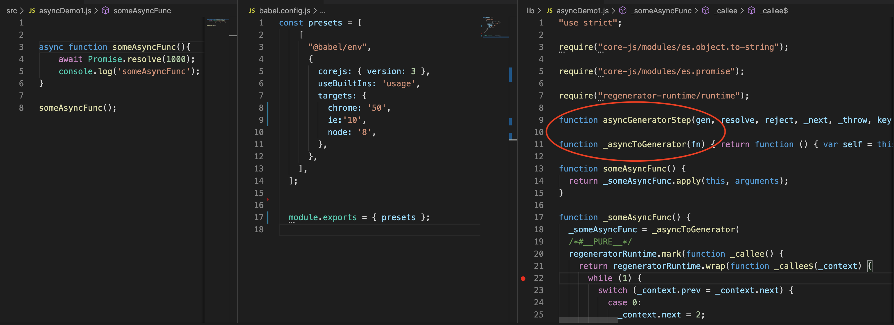
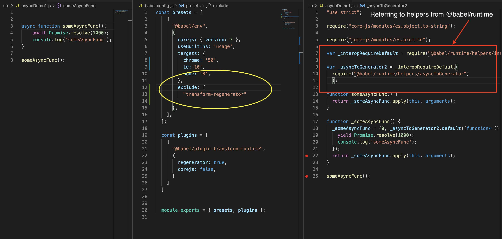
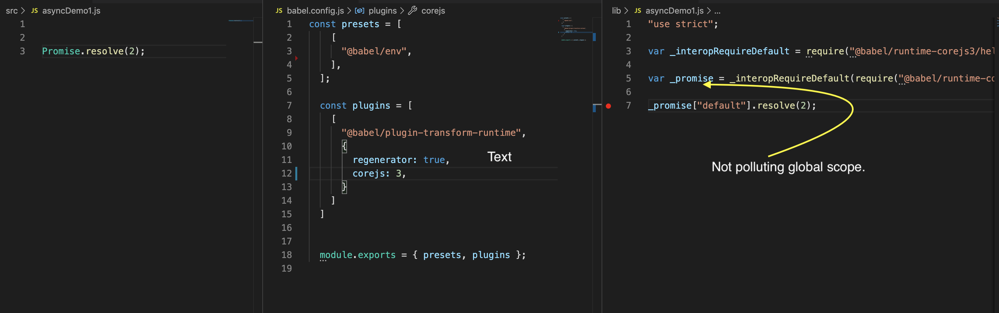

# Polyfills can be included into babel in following ways.

## Using [@babel/polyfill](https://babeljs.io/docs/en/babel-polyfill)(deprecated)
 
 ```npm install --save @babel/polyfill```
 
 After adding it in dependency. Import it in beginning of your project.
 ```import "@babel/polyfill";```
This will include all polyfills and regenerator-runtime. This also includes polyfill which are not necessary for target environments.

## Using [core-js](https://github.com/zloirock/core-js) and [regenerator-runtime](https://github.com/facebook/regenerator/tree/master/packages/regenerator-runtime) seperately.
```
npm install --save core-js
npm i regenerator-runtime
```
Add following statement in the beginning of your project.
```
import "core-js/stable";
import "regenerator-runtime/runtime";
```

Above two ways of including polyfills includes all polyfills(even the ones which are not necessary for target environment and the ones which are not used in our source code).

## Using [core-js](https://github.com/zloirock/core-js) and [regenerator-runtime](https://github.com/facebook/regenerator/tree/master/packages/regenerator-runtime) with [@babel/preset-env](https://babeljs.io/docs/en/babel-preset-env)

preset-env provides a way to 

1.include polyfills for all the esnext functionality which are not supported by target environments

2.include polyfills for esnext functionality which are not supported by target environment but used in our source code.

preset-env accepts an option ```useBuiltIns```. Depending upon the value provided to ```useBuiltIns``` Polyfills will be included differently.

1.useBuiltIns="entry"

include polyfills for all the esnext functionality which are not supported by target environments irrespective of whether we used it in our source code or not.

 
```
import 'core-js';
import 'regenerator-runtime/runtime';
``` 

include above 2 statements in the entry file of project. After transpiling those statements will be replaced with a polyfills that are necessary for given target.
  
 

For a given targets(Chrome:79 and node:8), import 'core-js' is replaced with individual require of 106 individual polyfills.
If we have node used useBuiltIns: 'entry', then all the polyfills in the core-js library would have included in output file(which is more that 106 polyfills).
Out of 106 polyfills we have only need 2 polyfills for our code to work; Remaining polyfills are added to support target environment.

Even if we have imported 'regenerator-runtime/runtime' in the source code, that polyfill is not there in the output file because both the targets natively supports generator and async functions.


Now let's remove the target node:8 and use only Chrome:79 as target.


No polyfills have been imported in output file because chrome(vesrion 79) by default supports Promise and Promise.finally functionality.


2.useBuiltIns="usage"

include polyfills for esnext functionality which are not supported by target environment but used in our source code.


In outputfile only 2 polyfills have been included; since only those 2 polyfills are required to run our source code in the specified targets.


## [@babel/plugin-transform-runtime](https://babeljs.io/docs/en/babel-plugin-transform-runtime)

When doing certain transformation, Babel adds lot of helper code.

Ex: when transforming async functions/generator functions babel adds few helper functions.

If async functions are used in 10 files, then the helper functions will be added in all 10 files.

Image showing the helper functions added by babel(see right tab). ```asyncGeneratorStep, _asyncToGenerator``` are helpers added by babel. If we have multiple files, it gets added in each file.


[@babel/plugin-transform-runtime](https://babeljs.io/docs/en/babel-plugin-transform-runtime) helps us avoid duplicates by referencing all helper functions from [@babel/runtime](https://babeljs.io/docs/en/babel-runtime).


In order to use plugin-transform-runtime, we need to add [@babel/runtime](https://babeljs.io/docs/en/babel-runtime) as production dependency and [@babel/plugin-transform-runtime](https://babeljs.io/docs/en/babel-plugin-transform-runtime) as dev dependency.

Also note the yellow highlight in above image. We need to exclude preset-env from importing [regenerator-runtime](https://github.com/facebook/regenerator/tree/master/packages/regenerator-runtime) because now 
[@babel/plugin-transform-runtime](https://babeljs.io/docs/en/babel-plugin-transform-runtime) includes it from [@babel/runtime](https://babeljs.io/docs/en/babel-runtime). Otherwise runtime get's imported twice.


All above mentioned ways of importing core-js polyfills will pollute the global scope. This is fine if we are using it in our app. If we are writing a library and we dont want to pollute the global scope.

we can achieve this by using [@babel/plugin-transform-runtime](https://babeljs.io/docs/en/babel-plugin-transform-runtime) with [@babel/runtime-corejs3](https://github.com/babel/babel/tree/master/packages/babel-runtime-corejs3) as shown below.

add [@babel/runtime-corejs3](https://github.com/babel/babel/tree/master/packages/babel-runtime-corejs3) as prod dependency instead of [@babel/runtime](https://babeljs.io/docs/en/babel-runtime).

Remove ```useBuiltIns``` from preset-env.

enable corejs in @babel/plugin-transform-runtime plugin options.


